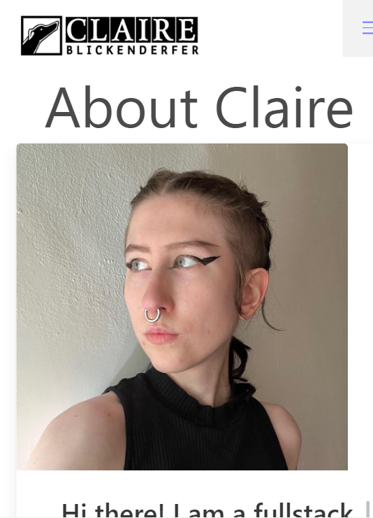

# Portfolio

## Overview

As a full stack web developer, it is imperative to have a portfolio website to host a collection of work and act as resource for potential employers to contact you. This application contains an about page, a portfolio page and a contact form. 

## Technologies

This application is written in Japascript, and uses Vite to run a page that will accommadate the React framework. The Bulma framework is used as well for styling purposes. 

## Credits

Built by GitHub user @blickenderfer.